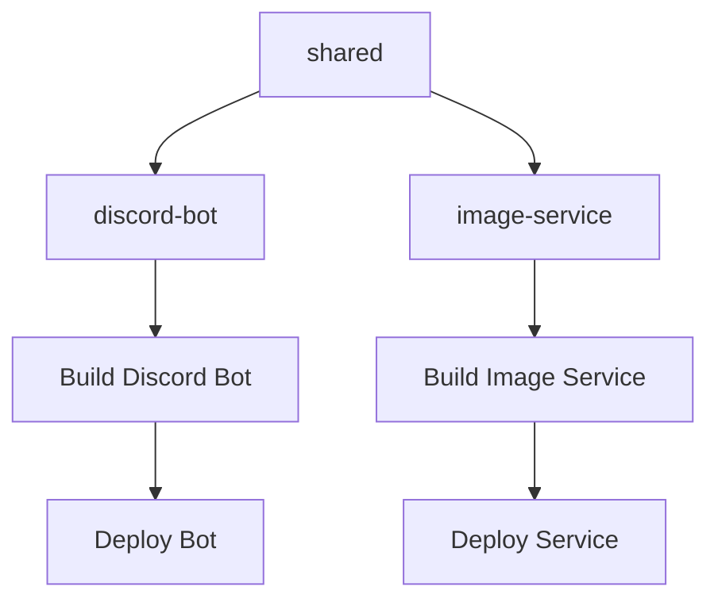

# Monorepo Structure

## Directory Layout

```
claude-code-discord-bot/
├── apps/
│   ├── discord-bot/            # Discord bot application
│   │   ├── src/                # Application source code
│   │   ├── .env                # Bot environment variables
│   │   ├── .env.example        # Environment template
│   │   ├── package.json        # Bot dependencies
│   │   ├── templates/          # Claude workflow templates
│   │   └── dist/               # Build output
│   └── image-service/          # Standalone image storage API
│       ├── src/                # Image service source code
│       ├── .env.example        # Image service environment template
│       ├── Dockerfile          # Production image service container
│       ├── docker-compose.dev.yml # Development docker setup
│       └── scripts/            # Key generation and utility scripts
├── packages/
│   └── shared/                 # Shared TypeScript types and utilities between services
│       ├── src/                # Type definitions
│       └── dist/               # Built type definitions
├── runners/
│   └── github-actions/         # Self-hosted GitHub Actions runner
│       ├── Dockerfile          # Runner container configuration
│       ├── docker-compose.yml  # Runner deployment setup
│       └── entrypoint.sh       # Runner auto-registration script
├── .github/
│   ├── workflows/              # CI/CD workflows
│   └── docs/                   # Additional documentation
├── .claude/                    # Claude Code configuration
├── docs/                       # Comprehensive documentation (this directory)
├── turbo.json                  # Turborepo configuration
├── package.json                # Root workspace configuration
├── pnpm-workspace.yaml         # PNPM workspace settings
├── commitlint.config.js        # Commit message validation
└── CLAUDE.md                   # Claude Code assistant guide
```

## Workspace Organization

### Apps Directory (`apps/`)
Contains the main applications of the monorepo:

#### Discord Bot (`apps/discord-bot/`)
- Main Discord bot application built with NestJS and Necord
- Handles Discord interactions, GitHub API integration, and workflow automation
- Contains templates for Claude Code workflows
- Self-contained with its own environment configuration

#### Image Service (`apps/image-service/`)
- Standalone NestJS API for temporary image storage
- Provides secure image upload and retrieval for Discord attachments
- Docker-ready with development and production configurations
- HMAC-signed authentication for security

### Packages Directory (`packages/`)
Contains shared code and utilities:

#### Shared Package (`packages/shared/`)
- Common TypeScript types and utilities used across applications
- Centralized logging system with Winston integration
- API response types and constants
- Built separately and consumed by applications

### Runners Directory (`runners/`)
Infrastructure for self-hosted GitHub Actions:

#### GitHub Actions Runner (`runners/github-actions/`)
- Dockerized self-hosted GitHub Actions runner
- Automatic registration with GitHub repositories
- Pre-configured with Node.js, pnpm, and development tools
- Supports Claude Code workflow execution

### Configuration Files

#### Root Configuration
- **`package.json`**: Root workspace with shared scripts and dependencies
- **`pnpm-workspace.yaml`**: PNPM workspace configuration
- **`turbo.json`**: Turborepo build pipeline and caching configuration
- **`commitlint.config.js`**: Commit message validation rules

#### CI/CD Configuration
- **`.github/workflows/`**: GitHub Actions CI/CD pipelines
- **`.github/docs/`**: Repository-specific documentation
- **`.claude/`**: Claude Code configuration and commands

#### Documentation
- **`docs/`**: Comprehensive modular documentation
- **`CLAUDE.md`**: Concise guide for Claude Code assistant sessions

## Workspace Dependencies

### Build Pipeline


### Package Relationships
- **`shared`**: Independent package, builds first
- **`discord-bot`**: Depends on `shared`, consumes logging and types
- **`image-service`**: Depends on `shared`, uses shared types and logger
- **Root workspace**: Orchestrates builds, linting, and testing

## Build System Benefits

### Turborepo Features
- **Incremental Builds**: Only rebuilds changed packages
- **Remote Caching**: Shared build cache across developers and CI
- **Parallel Execution**: Builds independent packages simultaneously
- **Task Dependencies**: Ensures proper build order

### PNPM Workspace Benefits
- **Disk Efficiency**: Shared dependencies across packages
- **Fast Installation**: Symlinked node_modules structure
- **Strict Dependencies**: Prevents phantom dependencies
- **Monorepo Support**: Native workspace support

## File Organization Principles

### Application Structure
Each application follows consistent structure:
- `src/` - Source code with clear module organization
- `package.json` - Application-specific dependencies
- `tsconfig.json` - TypeScript configuration
- `.env.example` - Environment variable template

### Shared Code Patterns
- Common types in `packages/shared/src/`
- Utilities organized by domain
- Proper export/import structure
- Version synchronization across packages

## Related Documentation

- [Discord Bot Architecture](./discord-bot.md) - Detailed bot structure
- [Image Service Architecture](./image-service.md) - Image service details
- [Shared Package](./shared-package.md) - Shared code organization
- [Development Commands](../development/commands.md) - Build and development commands

[← Back to Architecture](./README.md)